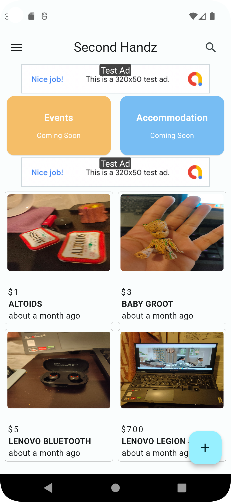
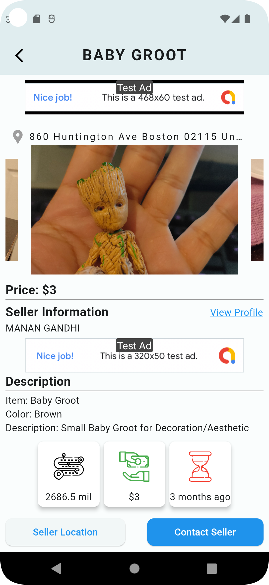
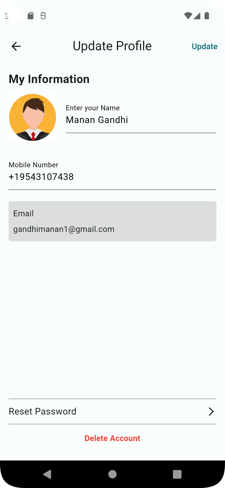

# Second Handz App

## Overview

Welcome to Second Handz, a Flutter-based mobile application designed to simplify the lives of university students by providing a platform to buy or sell second-hand items, search for temporary accommodation, and discover local events. This README.md file serves as a guide to help you understand the app's features, installation process, and usage.

## Features

### 1. Buy or Sell Second-Hand Items
- Easily list items for sale.
- Browse a variety of second-hand items available for purchase.
- In-app chat functionality for communication between buyers and sellers.

### 2. Temporary Accommodation Search
- Find temporary accommodation options near your university.
- Filter results based on preferences such as location, price, and amenities.
- Contact property owners directly through the app.

### 3. Events Discovery
- Stay informed about local events happening around your university.
- Filter events based on categories, date, and location.
- Get event details and directions.

## Screenshots


*Home Screen*


*Ad Screen*


*Profile Screen*

## Installation

1. Clone the repository to your local machine.
   ```bash
   git clone https://github.com/mananrg/Second-Cycle.git
   ```

2. Navigate to the project directory.
   ```bash
   cd Second-Cycle
   ```

3. Install dependencies using Flutter.
   ```bash
   flutter pub get
   ```
4. Add Firebase Config
5. Run the app on an emulator or connected device.
   ```bash
   flutter run
   ```

## Contributing

If you would like to contribute to Second Handz, please mail on gandhimanan1@gmail.com).

## License

Second Handz is licensed under the MIT License - see the [LICENSE](LICENSE) file for details.

---

Thank you for using Second Handz! We hope it enhances your university experience. If you have any questions or feedback, feel free to reach out to us at support@secondhandz.com.